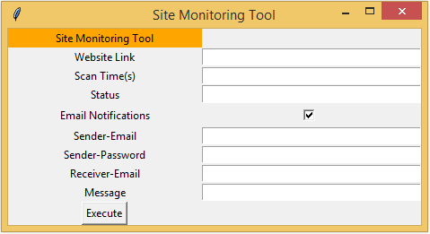

Project: Site Monitoring Tool

•	Implemented a tool to periodically monitor an inputted URL for any changes/updates then send text and email notifications to the user upon any recent updates.
•	Added a Graphical User Interface (GUI) to the tool using Tkinter to make it user-friendly.

